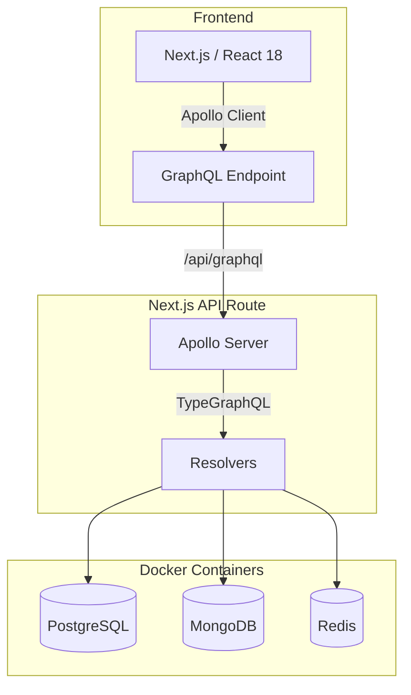

This page outlines the high-level architecture and directory structure of the Cracker platform.

## System Architecture

Cracker follows a modern full-stack serverless-compatible architecture, though it relies on persistent containerized storage for local development.

### Data Flow
1.  **Client**: The React frontend (MUI + Nivo) sends GraphQL queries/mutations using Apollo Client.
2.  **API Layer**: Requests are handled by Next.js API routes (`/pages/api/graphql.ts`).
3.  **Resolver Layer**: Apollo Server processes the request using schemas and resolvers defined with TypeGraphQL.
4.  **Data Layer**: Resolvers interact with:
    *   **PostgreSQL** for primary structured data.
    *   **MongoDB** for logs and unstructured data.
    *   **Redis** for caching frequently accessed data.

## Directory Structure

The project is organized to separate the frontend UI, GraphQL logic, and infrastructure configuration.

*   **`/pages`**: Next.js pages and API routes.
    *   `api/graphql.ts`: The entry point for the Apollo GraphQL server.
*   **`/graphql`**: Core logic for the GraphQL API and Client.
    *   `/resolvers`: Backend resolvers (business logic) for TypeGraphQL.
    *   `/schemas`: TypeGraphQL schemas and input type definitions.
    *   `/client`: Client-side GraphQL queries, mutations, and hooks.
*   **`/components`**: Reusable React UI components (built with Material UI).
*   **`/server`**: Infrastructure configuration.
    *   `docker-compose.yml`: Defines the backend services (DBs, Redis, Admin tools).
    *   Database initialization scripts.
*   **`/generated`**: Auto-generated TypeScript types from the GraphQL schema (via `graphql-codegen`).

## Key Technologies

*   **TypeGraphQL**: Used to define the schema and resolvers using TypeScript classes and decorators, enabling a "code-first" GraphQL development approach.
*   **Apollo Server**: Handles the GraphQL request lifecycle.
*   **Docker**: Encapsulates the database and caching layers, ensuring a consistent development environment.